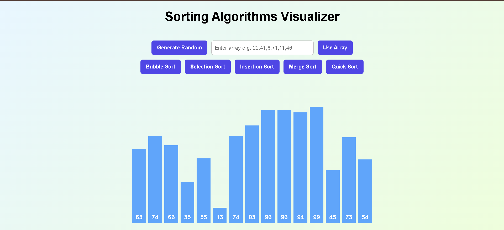

# 🔢 Sorting Algorithms Visualizer

An interactive web-based visualization tool to understand how popular **sorting algorithms** work step by step.  
Built using **HTML, CSS, and JavaScript**, this project visually demonstrates sorting through animated bars and a fun confetti celebration on completion.

---

## 🚀 Live Demo
👉 https://sirichandana17.github.io/Sorting-Algorithms-Visualizer/

---

## 🛠 Tech Stack
- **HTML** – Structure
- **CSS** – Styling & animations
- **JavaScript** – Sorting logic & visualization

---

## ✨ Features
- Generate **random arrays**
- Use **custom input arrays**
- Visualize sorting **step-by-step**
- Supported algorithms:
  - Bubble Sort
  - Selection Sort
  - Insertion Sort
  - Merge Sort
  - Quick Sort
- Smooth animations for comparisons and swaps
- Clean and responsive UI

---

## ⏱️ Time & Space Complexity

| Algorithm       | Best Case      | Average Case   | Worst Case     | Space Complexity |
|-----------------|---------------|---------------|---------------|------------------|
| Bubble Sort     | O(n)          | O(n²)         | O(n²)         | O(1)             |
| Selection Sort  | O(n²)         | O(n²)         | O(n²)         | O(1)             |
| Insertion Sort  | O(n)          | O(n²)         | O(n²)         | O(1)             |
| Merge Sort      | O(n log n)    | O(n log n)    | O(n log n)    | O(n)             |
| Quick Sort      | O(n log n)    | O(n log n)    | O(n²)         | O(log n)         |

---

## 🖼️ Screenshots

### 🔹 Visualization Interface

---

## 👩‍💻 Author

Siri Chandana Kanaparthi
---

